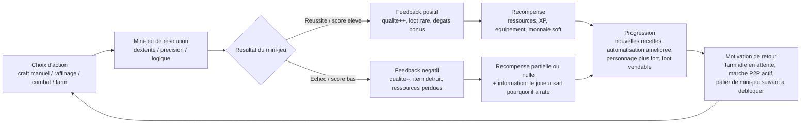

# Core Loop — Jeu Video Personnel (craft incrémental)

> Source : docs/FOUNDATION.md · Agent : Game Designer (#1) · Phase 1 — Fondation

## Diagramme (Mermaid)

## Description de la boucle principale

La boucle tourne autour d'un principe simple : **toute action clé passe par un mini-jeu, jamais par un simple jet de dés invisible.** C'est le pilier différenciant du jeu (voir GDD.md → Pillars), donc la core loop est volontairement construite pour que ce mini-jeu soit le cœur battant de chaque itération, pas une étape annexe.

1. **Action** — le joueur choisit quoi faire : forger un objet (craft manuel), optimiser une chaîne de raffinage, lancer une action de combat, ou simplement collecter la production de sa ferme automatisée.
2. **Mini-jeu** — sauf pour la collecte passive de farm hors-ligne (qui, elle, ne demande pas d'input actif — c'est la porte d'entrée casual/idle), chaque action est résolue par un mini-jeu contextuel : dextérité/précision pour le craft manuel, logique/puzzle pour le raffinage, timing/précision pour la résolution d'action en combat.
3. **Feedback immédiat** — le score du mini-jeu détermine directement le résultat, sans couche d'aléatoire supplémentaire cachée derrière. Réussite = qualité/dégâts en hausse. Échec = qualité en baisse, et dans les cas les plus risqués (recettes avancées), destruction de l'item en cours et perte des matériaux investis.
4. **Récompense** — ressources, XP, équipement, monnaie soft, ou objet de qualité supérieure vendable sur le marché P2P.
5. **Progression** — la récompense débloque ou améliore le système suivant dans la chaîne (craft manuel → raffinage → automatisation → combat → marché), ce qui crée l'enchaînement systémique voulu par FOUNDATION.md (diagramme use case section 4).
6. **Motivation de retour** — deux boucles de rappel coexistent : la boucle courte (le joueur veut retenter un mini-jeu qu'il vient de rater, ou enchaîner un craft) et la boucle longue (la production idle s'accumule hors-ligne, il y a une raison de revenir même après une pause).

### Pourquoi cette boucle et pas une autre

- Elle sert **les deux profils joueurs visés** (casual et try-hard) sans les séparer en deux jeux différents : le casual peut se contenter de la collecte idle + des mini-jeux faciles, le try-hard peut chercher le score parfait sur chaque mini-jeu et optimiser les chaînes de raffinage.
- Elle rend **chaque système dépendant du précédent**, ce qui donne une sensation de construction (une "tour" de progression) plutôt qu'un empilement de mini-jeux déconnectés — mais ça crée aussi un risque de fragilité si un maillon est faible (voir GDD.md → Selfdoubt).
- Le feedback est **immédiat et lisible** (Heuristique Nielsen #1 — visibilité de l'état) : le joueur comprend tout de suite pourquoi il a réussi ou raté, condition nécessaire pour que la destruction d'objet soit perçue comme juste et non punitive.
