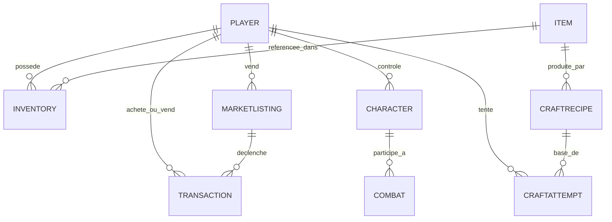
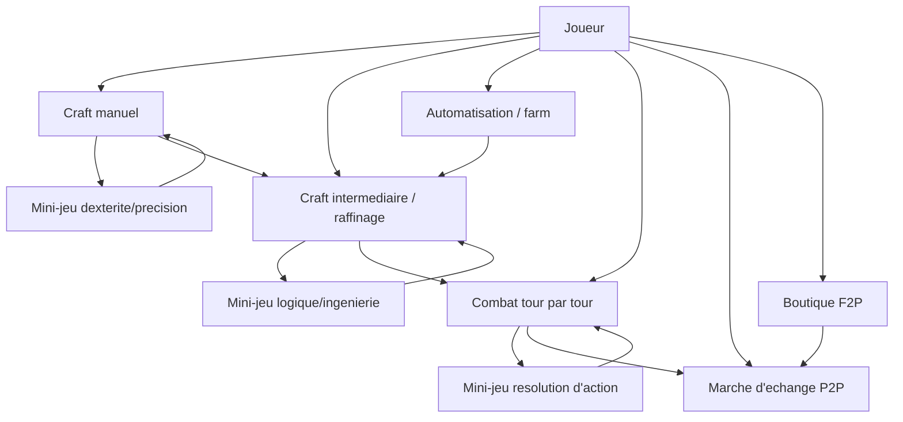

# Cahier des Charges — Jeu Video Personnel (craft incrémental) [nom du jeu à définir]
> mentalyas · Full-Stack Dev
> Date : 2026-09-15
> Statut : Brainstorm niveau 1 seul (projet Game Dev — pas de niveaux 2/3/4)
> Niveaux exécutés : docs/brainstorm/L1-fondation.md

---

## 1. Concept Global

Jeu mobile (iOS + Android) hybride qui combine gestion/craft/automatisation et combats tactiques tour par tour façon Wakfu/Pokémon. Sa mécanique différenciante : chaque action clé (craft manuel, raffinage, résolution de combat, farm) est validée par un **mini-jeu de dextérité/précision/logique** plutôt qu'un simple jet de dés ou une barre de progression — l'effort et l'habileté réelle du joueur influencent directement le résultat (qualité, réussite/échec, voire destruction de l'objet en cas d'échec). Conçu pour un public **hybride** : joueurs casual en sessions courtes (idle/incremental) et joueurs "try-hard" cherchant de la profondeur — les deux profils doivent y trouver leur compte. Développé en **Unity/C#**, en solo pour l'instant avec intention de recruter des collaborateurs en cours de route. Modèle économique **F2P inspiré de Warframe** : pay-to-skip + monnaie premium échangeable entre joueurs contre items/services, taxée à la transaction (source de revenu du jeu).

## 2. Fonctionnalités

### Fonctionnalités core (MVP)
- [ ] Craft manuel — précision/rapidité du joueur détermine la qualité du résultat, une mauvaise manipulation peut détruire l'item en cours (référence : *A Township's Tale*)
- [ ] Craft intermédiaire / raffinage — usinage avec logique et casse-tête d'automatisation pour optimiser rendement et fabrication (référence : *Alchemy Factory*)
- [ ] Automatisation / farm en arrière-plan — progression de ressources même quand le joueur n'est pas en train de jouer activement (mécanique idle)
- [ ] Combat tactique tour par tour sur grille (façon *Wakfu*, inspiration *Pokémon* pour la structure des affrontements)
- [ ] Système de mini-jeux transversal — dextérité, rythme, précision, logique/ingénierie — déclenché à chaque action clé du jeu (craft, combat, farm...), pensé pour rester addictif sans devenir fastidieux à la répétition
- [ ] Compte joueur + inventaire
- [ ] Marché d'échange joueur à joueur — monnaie premium contre items/services, taxe de transaction prélevée par le jeu
- [ ] Boutique F2P — achat de monnaie premium, options de pay-to-skip

### Fonctionnalités secondaires (v2+)
- [ ] Guildes/clans ou coopération multijoueur (non tranché — à explorer une fois le solo/socle posé)
- [ ] Extension du catalogue de mini-jeux (nouveaux types de dextérité/logique)
- [ ] Contenu additionnel porté par les futurs collaborateurs recrutés

### Hors scope (explicitement exclu)
- Deadline ou date de sortie imposée — rythme libre, projet loisir
- Portage desktop/console dans un premier temps — mobile only (iOS + Android)

## 3. Structure de Base de Données

Le marché d'échange joueur à joueur avec monnaie premium implique un **backend serveur autoritaire** (pas de logique économique côté client) — impératif pour éviter la fraude/duplication.

### Entités principales
| Entité | Champs clés | Relations |
|--------|-------------|-----------|
| Player | id, username, auth_provider_id, soft_currency, premium_currency, created_at | 1-N Inventory, 1-N MarketListing, 1-N Transaction |
| Item | id, type (craft manuel / raffiné / équipement / combat), rarity, stats (JSON) | N-N via Inventory, référencé par CraftRecipe |
| Inventory | player_id, item_id, quantity | N-1 Player, N-1 Item |
| CraftRecipe | id, craft_type (manuel/raffinage/auto), inputs (JSON), outputs (JSON), difficulty_minigame | 1-N CraftAttempt |
| CraftAttempt | id, player_id, recipe_id, minigame_score, result (succès/échec/qualité), timestamp | N-1 Player, N-1 CraftRecipe |
| Character/Creature | id, player_id, stats, position_grille, niveau | N-1 Player, utilisé en Combat |
| Combat | id, participants (JSON), état (machine à états), log_tours | N-N Character |
| MarketListing | id, seller_id, item_id ou montant_devise, prix, taxe, status (ouvert/vendu/annulé) | N-1 Player (seller) |
| Transaction | id, buyer_id, seller_id, montant, taxe_prelevee, listing_id, timestamp | N-1 Player (x2), N-1 MarketListing |

### Diagramme ERD (Mermaid)

## 4. Diagrammes Use Cases — Vue d'ensemble (Mermaid)

## 5. Stack Technologique Recommandée
| Couche | Technologie | Justification |
|--------|-------------|---------------|
| Client mobile | Unity (C#) | Choix validé — cohérent avec le profil C#/C++ de mentalyas, cible iOS + Android en un seul codebase |
| Backend économie/comptes | ASP.NET Core (C#) **ou** service managé (Unity Gaming Services Economy / PlayFab) | Partage le langage avec le client Unity (DTOs réutilisables) ; alternative managée à considérer sérieusement pour déléguer la partie la plus risquée (anti-fraude, transactions, marché P2P) plutôt que la réécrire from scratch |
| Base de données | PostgreSQL | Intégrité transactionnelle (ACID) indispensable pour une économie avec vraie monnaie en jeu |
| Auth | IAP officiel Store (Apple/Google) + compte joueur backend (JWT) | Évite de gérer soi-même les paiements (réduit drastiquement la charge de conformité PCI-DSS) |
| Hébergement | Azure (naturel si ASP.NET Core / PlayFab) ou AWS | À trancher selon le choix backend |
| CI/CD | GitHub Actions + Unity Cloud Build | Build mobile automatisé iOS/Android |

> **Suggestion à trancher tôt** : construire un système de trading P2P + anti-fraude économique from scratch est un chantier backend lourd (bien plus que le reste du jeu). Avant de partir sur du custom, vaut le coup d'évaluer **Unity Gaming Services (Economy + Cloud Save)** ou **PlayFab** (Microsoft/Azure) qui proposent nativement gestion de monnaie virtuelle, inventaire, et parfois des primitives de marché — potentiellement des mois de dev économisés, au prix d'un vendor lock-in à évaluer.

## 6. Algorithmes & Patterns Techniques
- **Machine à états (State Machine)** — orchestration des tours de combat (idle → sélection action → mini-jeu → résolution → tour suivant)
- **Grid-based positioning / pathfinding** — placement tactique façon Wakfu (potentiellement A* si obstacles de terrain)
- **Idle/offline progression** — calcul de la production d'automatisation pendant l'absence du joueur (delta de temps écoulé, caps de stockage pour éviter l'accumulation infinie)
- **Validation serveur-autoritaire** — chaque résultat de mini-jeu, craft ou transaction doit être validé côté serveur, jamais fait confiance au client (anti-triche indispensable dès lors qu'une vraie monnaie est en jeu)
- **Procedural/adaptive difficulty** — ajuster la difficulté des mini-jeux selon le profil du joueur (casual vs try-hard) sans casser l'équilibrage économique

## 7. Sécurité — Bloc Dédié

### Niveau de sensibilité des données
**Élevé** — comptes joueurs, paiements réels (IAP), monnaie premium échangeable entre joueurs (quasi-monétaire), potentiel enjeu réglementaire loot-box/jeux d'argent selon les pays de lancement.

### Vulnérabilités à anticiper
| Risque | Vecteur | Mitigation |
|--------|---------|------------|
| Duplication de monnaie/items (dupe exploit) | Race condition sur transactions, requêtes rejouées | Transactions atomiques, idempotency keys, validation serveur exclusive |
| Triche sur les mini-jeux (memory editing, bots, speedhack) | Client modifié, résultats falsifiés envoyés au serveur | Le serveur revalide/borne les scores plausibles, ne fait jamais confiance au résultat brut du client |
| Blanchiment / abus du marché P2P | Transactions répétées entre comptes liés pour déplacer de la valeur | Monitoring des patterns de transaction, limites, détection de comptes liés |
| Paiement (IAP) | Gestion de paiement custom non conforme | Passer exclusivement par les stores officiels (Apple/Google), jamais de système de paiement maison |
| RGPD comptes joueurs | Données personnelles (email, éventuellement localisation via store) | Consentement explicite, minimisation des données, droit à l'oubli |
| Réglementation loot-box / monnaie virtuelle échangeable | Certains pays (ex. Belgique) encadrent strictement les mécaniques proches du jeu d'argent | Vérifier la réglementation des pays de lancement avant d'activer le marché P2P en argent réel |

### Exceptions & Gestion d'erreurs
- Ne jamais exposer les stack traces en production (client mobile comme backend).
- Messages d'erreur génériques côté client pour toute opération économique en échec.
- Logging structuré et **audit trail immuable** de toutes les transactions (obligatoire pour litiges/support).

### Checklist sécurité minimale
- [ ] Authentification via IAP store officiel + JWT backend (jamais de mot de passe géré maison pour les paiements)
- [ ] HTTPS/TLS obligatoire sur toutes les communications client-serveur
- [ ] Validation serveur de **toutes** les actions économiques (craft, combat, trading) — zéro confiance au client
- [ ] Rate limiting sur les endpoints de trading et de mini-jeux
- [ ] Variables d'env pour tous les secrets (clés stores, DB, JWT signing key)
- [ ] Vérification légale loot-box/monnaie échangeable par pays de lancement avant mise en production du marché P2P

## 8. Références
| Référence | Ce qui est inspirant | Ce qu'on fait différemment |
|-----------|---------------------|---------------------------|
| *A Township's Tale* (VR) | Craft manuel où l'effort/la précision physique du joueur prime sur un simple bouton — erreur = destruction de l'item | Adapté au tactile mobile (pas de VR) via mini-jeux de dextérité/précision |
| *Alchemy Factory* | Craft intermédiaire par usinage, logique et casse-tête d'automatisation pour optimiser le rendement | Intégré comme deuxième couche de craft, reliée en amont au craft manuel et en aval à l'automatisation/farm |
| *Pokémon* | Structure de combat tour par tour lisible et accessible | Enrichi par un système de mini-jeux de résolution d'action à chaque tour |
| *Wakfu* | Combat tactique avec positionnement sur grille | Combiné aux mini-jeux d'action plutôt qu'un système purement stats/PA-PM |
| *Warframe* | Modèle F2P avec monnaie premium (Platinum) échangeable entre joueurs | Ajout d'une taxe de transaction prélevée par le jeu comme source de revenu structurelle |

## 12. Résumé exécutif & Statut

### Résumé exécutif (pour business plan)
Le marché mobile F2P regorge de jeux idle/gacha peu exigeants et de RPG tactiques classiques, mais peu combinent un craft à forte composante skill-based (où l'habileté du joueur compte autant que la progression du personnage) avec un combat tactique profond. Ce projet cible un public hybride casual + try-hard via un liant original : des mini-jeux de dextérité/logique qui remplacent les jets de dés à chaque étape clé (craft, raffinage, combat), rendant chaque action rejouable et gratifiante plutôt que purement statistique. Modèle économique F2P inspiré de Warframe (monnaie premium échangeable entre joueurs, taxée à la transaction), qui aligne la monétisation sur l'engagement plutôt que sur la seule dépense directe.

### Points ouverts / décisions restantes
- [ ] Nom définitif du jeu (actuellement placeholder = nom du dossier projet)
- [ ] Backend custom (ASP.NET Core) vs service managé (Unity Gaming Services / PlayFab) pour l'économie
- [ ] Multijoueur/guildes : v2+ ou à explorer plus tôt selon envies de collaboration future
- [ ] Vérification réglementaire loot-box/monnaie virtuelle par pays de lancement visés

### Prochaines étapes
1. Activer l'équipe d'agents Game Dev (`/pipeline init gamedev`) pour l'implémentation
2. Trancher le point backend custom vs managé avant que le Technical Director (agent #2) ne fige l'architecture
