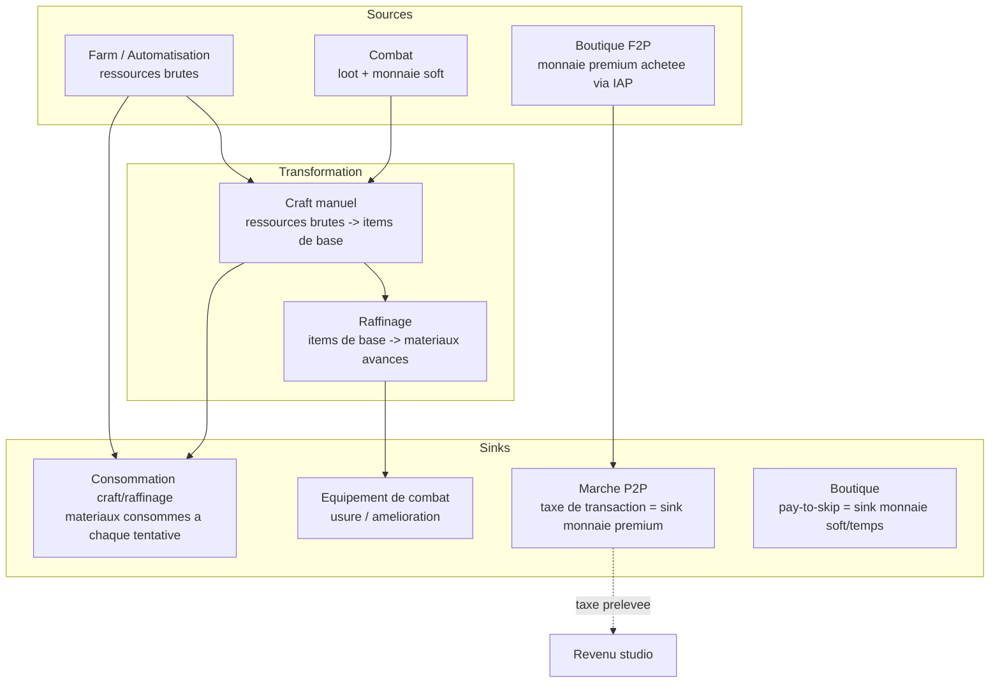

# GDD — Game Design Document
## Jeu Video Personnel (craft incrémental) [nom du jeu à définir]

> mentalyas · Full-Stack Dev — profil hybride
> Agent : Game Designer (#1) · Pipeline Game Dev · Phase 1 — Fondation
> Date : 2026-09-15
> Entrée : docs/FOUNDATION.md (brainstorm niveau 1)
> Voir aussi : docs/CORE-LOOP.md · docs/SYSTEMS.md · docs/SCOPE.md

---

## 0. Contexte

Jeu mobile (iOS + Android, Unity/C#) hybride craft/gestion/automatisation + combat tactique tour par tour. Sa mécanique différenciante : chaque action clé (craft manuel, raffinage, combat, farm) est résolue par un **mini-jeu de dextérité/précision/logique** plutôt qu'un jet de dés — l'habileté réelle du joueur influence directement le résultat. Public visé hybride : casual (sessions courtes, idle) et try-hard (profondeur, optimisation). Modèle économique F2P façon *Warframe* : pay-to-skip + monnaie premium échangeable entre joueurs, taxée à la transaction. Développement solo (Unity/C#) avec intention de recruter des collaborateurs plus tard.

Ce document ne réécrit pas FOUNDATION.md — il le transforme en decisions de design actionnables pour l'agent suivant (Technical Director, #2), qui doit figer l'architecture technique sur cette base.

---

## 1. Pillars du design

Ces principes sont **non négociables** : toute mécanique future qui les contredit doit être rejetée ou retravaillée, quel que soit son intérêt apparent.

### Pillar 1 — L'habileté prime sur le hasard
Aucune action clé n'est résolue par un jet de dés invisible. Craft, raffinage et combat passent tous par un mini-jeu où le geste réel du joueur détermine le résultat. C'est la promesse centrale du jeu (voir FOUNDATION.md §1) — si ce pillar est trahi quelque part (ex. un raccourci "auto-résoudre" qui donne le même résultat moyen qu'un joueur skillé), la proposition de valeur du jeu s'effondre.

### Pillar 2 — Deux tempos, un seul jeu
Le joueur casual (session de 5 minutes, collecte idle) et le joueur try-hard (session de 2 heures, optimisation de chaîne de raffinage, combat exigeant) doivent coexister **dans le même système**, pas dans deux jeux séparés artificiellement reliés. Toute fonctionnalité doit être évaluée sur les deux profils : est-ce qu'elle apporte quelque chose au joueur pressé ET au joueur engagé ?

### Pillar 3 — La monétisation achète du temps, jamais de la puissance ni du skill
Conforme au modèle Warframe visé : pay-to-skip (accélérer, pas remplacer) et marché P2P (échange entre joueurs, taxé). Aucun élément payant ne doit permettre de sauter le mini-jeu ou d'obtenir un résultat supérieur à ce qu'un joueur skillé obtiendrait gratuitement. C'est ce qui protège le Pillar 1 de la dérive pay-to-win.

### Pillar 4 — Chaque système nourrit le suivant
Craft manuel → raffinage → automatisation → combat → marché : aucun système n'est une île. Une fonctionnalité qui n'alimente ni ne consomme rien d'un autre système du jeu est suspecte et doit être justifiée avant d'être ajoutée (anti-feature creep, cohérent avec YAGNI).

---

## 2. Core Loop

Voir **docs/CORE-LOOP.md** pour le diagramme Mermaid complet et sa justification détaillée.

Résumé : Action (craft/raffinage/combat/farm) → Mini-jeu de résolution → Feedback immédiat (qualité/dégâts en hausse ou en baisse, voire destruction d'item) → Récompense (ressources, XP, équipement, monnaie) → Progression (débloque le système suivant dans la chaîne) → Motivation de retour (production idle en attente, marché actif, nouveau palier de mini-jeu) → retour à l'Action.

---

## 3. Systèmes de jeu

Voir **docs/SYSTEMS.md** pour le détail complet (but, mécaniques, interactions, risques) de chacun des 7 systèmes identifiés dans FOUNDATION.md :

1. Craft manuel
2. Craft intermédiaire / raffinage
3. Automatisation / farm en arrière-plan
4. Combat tactique tour par tour
5. Système de mini-jeux transversal
6. Marché d'échange P2P
7. Boutique F2P

---

## 4. Économie et balance

### Boucle économique (Mermaid)

**Principe de balance** : la taxe de transaction du marché P2P est le sink principal de monnaie premium (elle retire de la valeur en circulation à chaque échange, comme dans Warframe), ce qui évite l'inflation et génère le revenu du studio. La destruction d'items en cas d'échec de mini-jeu est un sink de ressources/matériaux — c'est un choix de design volontaire qui rend le craft manuel risqué et donc gratifiant en cas de réussite (cohérent avec Pillar 1), mais qui doit rester calibré pour ne pas punir excessivement le joueur débutant (voir SYSTEMS.md §1 et Selfdoubt ci-dessous).

### Courbe de progression préliminaire

Cette courbe est **indicative**, pas chiffrée — la balance numérique précise (taux de drop, temps de production, courbes XP) est un travail de QA/playtesting itératif (Phase 4), pas de design initial. Elle sert de cadre pour le Technical Director et le Gameplay Programmer.

| Phase | Durée indicative | Ce que le joueur fait | Systèmes actifs |
|---|---|---|---|
| Onboarding | 0–30 min | Premier craft manuel guidé, premier combat tutoriel, mise en route de la farm automatisée | Craft manuel, mini-jeux (difficulté minimale), combat simplifié |
| Early game | Sessions 1–5 | Craft manuel en autonomie, découverte du raffinage basique, farm qui tourne en fond | + Raffinage (mode simplifié) |
| Mid game | Semaines 1–4 | Chaînes de raffinage plus complexes, combats plus exigeants, premiers échecs destructifs sur recettes avancées | + Combat approfondi, marché P2P (consultation) |
| Late game | Mois 1+ | Spécialisation des chaînes de production, farming d'équipement de haut niveau, activité sur le marché (achat/vente) | Tous systèmes, marché P2P actif |
| Endgame | Continu | Optimisation, complétion, revenu/échange sur le marché comme objectif en soi | Tous systèmes, orienté try-hard |

Le point de vigilance : la pente entre "Early" et "Mid" doit être assez douce pour ne pas perdre le joueur casual (qui peut rester confortablement en Early game indéfiniment sans se sentir largué), tout en offrant assez de profondeur en Mid/Late pour retenir le try-hard. C'est un équilibre qui ne peut être validé que par playtest réel, pas par la théorie (voir Selfdoubt).

---

## 5. Scope

Voir **docs/SCOPE.md** pour la classification complète et sa justification méthodologique.

**Résumé** :
- **CORE** : système de mini-jeux transversal, craft manuel, automatisation/farm basique, combat tactique simple, compte joueur + inventaire, backend serveur-autoritaire minimal.
- **IMPORTANT** : raffinage, marché P2P complet, boutique F2P, difficulté adaptative.
- **NICE-TO-HAVE** : guildes/coop, PvP, extension du catalogue de mini-jeux, contenu de futurs collaborateurs.

Point notable : ce classement **diffère** de la liste "MVP" plate de FOUNDATION.md en repoussant le marché P2P et la boutique en IMPORTANT plutôt que CORE-jour-1, pour des raisons de risque technique/légal — voir la note de méthode dans SCOPE.md. **Ce point doit être validé explicitement par mentalyas et pris en compte par le Technical Director avant de figer le séquençage de développement.**

---

## 6. Selfdoubt — hypothèses de fun, interdépendances, réalisme du scope

Conformément à la règle du projet (`~/.claude/skills/selfdoubt/SKILL.md`), voici l'audit d'incertitude sur les décisions de ce GDD. Le principe directeur reste : **ne jamais confondre "intéressant en théorie" et "fun en pratique"** — chaque ligne ci-dessous distingue ce qui est vérifié de ce qui est une hypothèse de design non testée.

| # | Affirmation | Niveau | Action recommandée |
|---|---|---|---|
| 1 | Les mini-jeux resteront fun/engageants après des dizaines/centaines de répétitions | ❌ Hypothèse | C'est le risque #1 du projet (voir SYSTEMS.md §5). Prototyper 2-3 mini-jeux jouables dès la Phase 3 (implémentation) et les faire tester en dehors du studio, avant d'investir dans le contenu des autres systèmes qui en dépendent. |
| 2 | Le mix casual + try-hard fonctionnera dans une seule et même économie sans qu'un profil écrase l'autre | ⚠️ Probable | Playtest avec au moins deux profils de testeurs distincts (un joueur idle-only, un joueur optimisateur) une fois un vertical slice jouable disponible. |
| 3 | La destruction d'item en cas d'échec de craft (Pillar 1) ne provoque pas un churn excessif chez les joueurs casual | ❌ Hypothèse | Réserver la destruction aux recettes avancées uniquement (jamais au tutoriel/early game), mesurer le taux d'abandon post-échec en playtest avant de généraliser la mécanique. |
| 4 | Un développeur solo peut livrer un marché P2P sécurisé (anti-fraude, serveur-autoritaire) dans un délai raisonnable | ❌ Hypothèse (risque élevé) | D'où le classement IMPORTANT plutôt que CORE-jour-1 dans SCOPE.md. Réévaluer sérieusement l'option service managé (Unity Gaming Services Economy / PlayFab) déjà suggérée dans FOUNDATION.md §5 — c'est une décision que le Technical Director doit trancher tôt, pas repousser. |
| 5 | La double couche de skill en combat (stats de build + mini-jeu de résolution) sera perçue comme complémentaire et non redondante/confuse | ⚠️ Probable | Prototyper le combat isolément et le jouer soi-même sur au moins 20 affrontements avant de valider la mécanique définitivement — un mauvais dosage rendrait soit les stats inutiles, soit le mini-jeu accessoire. |
| 6 | La progression idle (automatisation/farm) ne trivialisera pas le craft manuel actif | ⚠️ Probable | Nécessite une balance itérative testée en conditions réelles (voir courbe de progression §4) — pas calculable a priori de façon fiable. |
| 7 | Le séquençage de développement proposé (craft manuel → mini-jeux → automatisation → combat → [raffinage, marché, boutique]) est réaliste en temps pour un solo dev avec ambition de recrutement | ⚠️ Probable sur la logique de séquençage, ❌ Hypothèse sur le temps réel nécessaire | Le Technical Director doit estimer un temps de dev par système ; si le combat tactique + IA s'avère disproportionné par rapport aux autres systèmes CORE, il pourrait être nécessaire de le simplifier davantage pour le MVP (voir alerte ci-dessous). |
| 8 | Le marché P2P avec monnaie échangeable pourra être activé dans les pays visés sans blocage réglementaire (loot-box/jeu d'argent) | ❌ Hypothèse | Vérification légale par pays de lancement, déjà notée comme point ouvert dans FOUNDATION.md §12 — ne pas développer le marché en argent réel avant cette vérification. |
| 9 | Interconnecter tous les systèmes (Pillar 4) rend le jeu plus riche sans le rendre plus fragile en cas de système faible | ⚠️ Probable | Un système faible (ex. mini-jeux qui déçoivent) se propage à toute la chaîne puisque rien n'est une île — c'est un choix de design assumé (cohérence/lisibilité) mais qui augmente le risque systémique si l'hypothèse #1 échoue. À surveiller en priorité. |

**Hedge-to-Verify Ratio** : 8 affirmations sur 9 sont marquées ⚠️ Probable ou ❌ Hypothèse (89%). Ce ratio est délibérément élevé et **doit être communiqué tel quel** plutôt que masqué par une fausse certitude : à ce stade du pipeline (fin de Phase 1, avant tout code), la quasi-totalité des paris de fun et de faisabilité solo restent à vérifier par le prototypage et le playtest, pas par le design sur papier. Le document reste actionnable malgré ce ratio, à condition que la Phase 3 (implémentation) commence par un vertical slice minimal centré sur l'affirmation #1 (le mini-jeu), qui conditionne la validité de toutes les autres.

---

## 7. Alerte pour l'agent suivant (Technical Director, #2)

- **Décision à trancher en premier, avant l'architecture** : marché P2P/monnaie premium en backend custom (ASP.NET Core) vs service managé (Unity Gaming Services Economy / PlayFab) — voir Selfdoubt #4 et FOUNDATION.md §5. Ce choix a un impact direct sur le séquençage de dev proposé en SCOPE.md.
- **Le système de mini-jeux transversal (SYSTEMS.md §5) est la fondation technique la plus critique** : son architecture doit permettre d'ajouter/retirer des mini-jeux facilement (catalogue extensible) puisque son contenu va très probablement être itéré plusieurs fois après playtest, contrairement aux autres systèmes plus stables une fois posés.
- **Le combat tactique (SYSTEMS.md §4) est identifié comme le système CORE le plus lourd à développer** (IA, pathfinding, double couche de skill) — si les estimations de temps le confirment, envisager de simplifier drastiquement l'IA et le nombre d'effets de combat pour le MVP, quitte à enrichir en v2, plutôt que de retarder tout le jeu sur ce seul système.
- **Le backend doit être serveur-autoritaire dès le MVP** (même sans marché P2P actif) pour valider les résultats de mini-jeux, de craft et de combat — ce n'est pas un ajout différable sans risque, contrairement au marché lui-même (voir SCOPE.md).
- **Le mode de raffinage MVP doit rester volontairement simple** (3–5 modules max, cf SYSTEMS.md §2) pour ne pas dériver vers un vrai jeu de factory-building qui dépasserait le scope solo.
