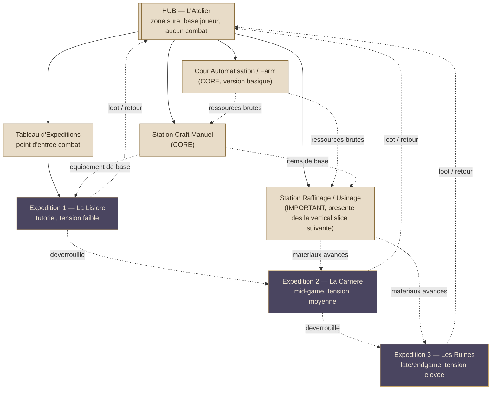
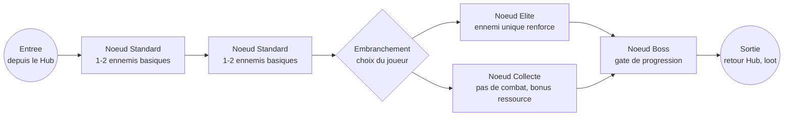

# World Map — Jeu Vidéo Personnel (craft incrémental)

> Agent : World Builder (#5) · Pipeline Game Dev · Phase 2 — Design
> Date : 2026-09-15
> Source : docs/FOUNDATION.md, docs/GDD.md, docs/CORE-LOOP.md, docs/SYSTEMS.md, docs/SCOPE.md, docs/ARCHITECTURE.md, docs/VERTICAL-SLICE.md
> Périmètre : zones qui supportent le CORE (craft manuel, raffinage/usinage, farm/automatisation, combat).
> **Le marché P2P et la boutique F2P n'ont aucune zone dédiée dans ce document** — reportés par le porteur du projet, cohérent avec SCOPE.md (IMPORTANT, pas CORE-jour-1) et ARCHITECTURE.md §5 (stub `IEconomyService`).

---

## 0. Décision structurante : Hub-and-spoke, pas de monde ouvert

Le jeu est mobile, avec des sessions courtes possibles (GDD Pillar 2 — casual + try-hard dans le même système). Un monde ouvert explorable est **explicitement rejeté** pour ce projet : il ajouterait un chantier de traversal/exploration (mouvement libre, streaming de zone, caméra 3D complexe) qui n'existe dans aucun document produit par le Game Designer ou le Technical Director, et qui romprait la promesse "entrer/sortir proprement" d'une session courte.

**Structure retenue : Hub-and-spoke.**
- Un **Hub** central (L'Atelier) — petite scène explorable, traversable en moins de 10 secondes d'un bout à l'autre, qui regroupe les stations liées au CORE (craft manuel, raffinage, farm/automatisation) et le point d'accès au combat.
- Des **Expéditions** — arènes de combat instanciées (grille simple, cf. §2), sélectionnées depuis un tableau d'expéditions dans le Hub, pas traversées dans un monde continu. Chaque expédition est une **séquence de nœuds** (façon carte de roguelite léger), pas un niveau ouvert.

Ce choix sert directement Pillar 2 du GDD : le joueur casual entre, collecte sa farm, lance un craft, ressort — sans traverser un monde. Le joueur try-hard peut enchaîner plusieurs nœuds d'expédition dans une session longue. Les deux profils utilisent la même carte, pas deux jeux séparés.

---

## 1. Carte macro (Mermaid)

**Lecture du flux joueur** : toute production (farm → craft → raffinage) reste physiquement dans le Hub, sans écran de chargement entre stations (ce sont des points d'intérêt dans une seule petite scène). Le combat est le seul aller-retour "hors du Hub" via le Tableau d'Expéditions, qui agit comme un menu de sélection (pas une carte du monde traversée à pied) — cohérent avec le scope solo et l'absence de besoin de pathfinding d'exploration dans ARCHITECTURE.md.

---

## 2. Structure interne d'une expédition — séquence de nœuds (Mermaid)

Chaque expédition n'est pas un niveau continu mais une **suite de rencontres discrètes**, à la manière d'une carte de roguelite léger (chaque nœud = une instance de grille de combat séparée, rechargée proprement). Ce choix limite la portée technique (pas de grande grille à streamer, pas de sauvegarde d'état complexe au milieu d'un niveau) et fournit des points d'entrée/sortie propres à chaque nœud (retour au Hub possible entre deux nœuds sans perte de progression) — essentiel pour les sessions courtes mobiles.

- **Standard** : valide la boucle mini-jeu de combat de base, faible enjeu.
- **Elite** : meilleur loot, single ennemi renforcé — teste le build sans multiplier la charge d'IA (une seule instance d'`ICombatant`/`IEnemyAI` à gérer, cohérent avec la recommandation `AggressiveAI` unique du Technical Director).
- **Collecte** : nœud non-combat, respecte Pillar 2 (une alternative pour le joueur qui veut avancer sans mini-jeu de combat à ce tour-ci) et sert de "raccourci" doux dans la séquence.
- **Boss** : point de gate — condition de déverrouillage de l'expédition suivante (§1), donne le rythme macro de progression décrit dans GDD.md §4 (courbe de progression).

Une expédition MVP (biome "La Lisière") compte volontairement **4 à 6 nœuds max** — assez pour tenir une session try-hard de 15-20 minutes, assez court pour qu'un joueur casual puisse s'arrêter après 1-2 nœuds sans frustration (retour au Hub possible après chaque nœud, jamais forcé de finir la séquence en une fois).

---

## 3. Flux joueur — entrée/sortie propre (contrainte mobile)

| Transition | Écran de chargement ? | Sauvegarde ? |
|---|---|---|
| Hub → Station (craft/raffinage/farm) | Non — zones du même petit espace | État sauvegardé après chaque action résolue (craft terminé, tick de farm) |
| Hub → Tableau d'expéditions | Non — UI overlay | — |
| Tableau d'expéditions → Nœud de combat | Oui (chargement de scène de grille, court — cf. Technical Director, grille petite échelle) | Sauvegarde de la progression d'expédition (quel nœud atteint) au retour au Hub, pas en plein combat |
| Nœud → Nœud suivant (même expédition) | Oui (rechargement de grille) | Le joueur peut quitter vers le Hub entre deux nœuds sans perdre le loot déjà obtenu |
| Retour au Hub (fin d'expédition ou abandon volontaire) | Oui | Sauvegarde complète |

Ce découpage garantit qu'aucune session ne peut être "coupée en plein milieu" de façon punitive (jamais de perte de progression en sortant entre deux nœuds) — aligné avec Nielsen #3 (annuler/quitter disponible) et le besoin explicite de sessions courtes mobiles.

---

## 4. Ce que cette carte ne contient pas (volontairement)

- Pas de zone/level dédié au marché P2P ni à la boutique F2P — scope explicitement reporté par le porteur du projet.
- Pas de monde ouvert explorable entre les expéditions — uniquement un menu de sélection depuis le Hub.
- Pas de traversal à pied dans les expéditions elles-mêmes — chaque nœud est une grille de combat autonome, pas un niveau parcouru.
- Pas de biome au-delà de 3 pour le MVP+roadmap proche (voir ZONE-DESIGN.md §5 pour la justification du nombre).
