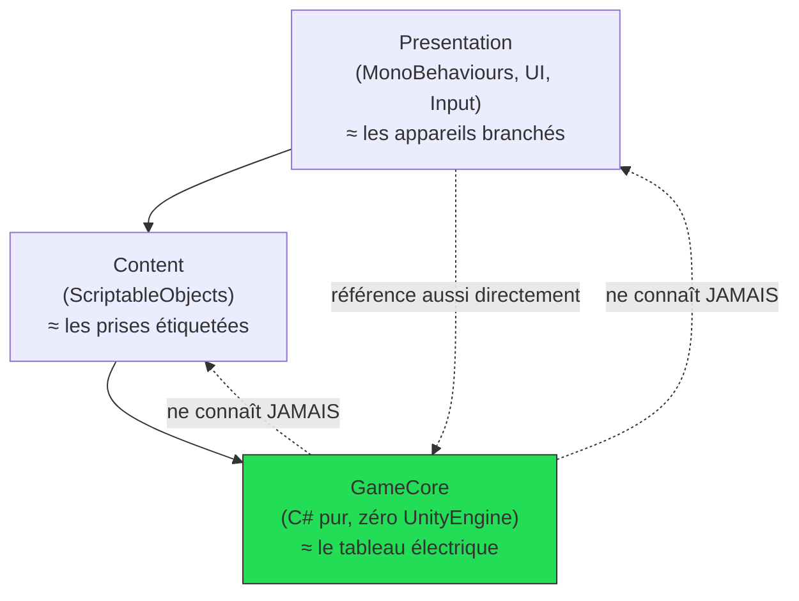

# Architecture en couches — GameCore / Content / Presentation

> **Résumé (30 secondes)** : le code Unity du projet est coupé en 3 couches qui ne se parlent que dans un seul sens : **GameCore** (les règles du jeu, en C# pur), **Content** (les données de contenu), **Presentation** (l'affichage). Une couche du bas ne sait jamais qu'une couche du dessus existe. Résultat concret : la logique de craft/combat se teste sans jamais ouvrir Unity.

---

## Ancrage concret — la multiprise électrique de la maison

- **GameCore = le tableau électrique.** Il produit et distribue un courant standardisé (des méthodes, des interfaces). Il ne sait pas quels appareils seront branchés un jour, et ça ne le regarde pas.
- **Content = les prises murales étiquetées.** Chaque prise (un `ScriptableObject`, un fichier de données) porte une étiquette (un identifiant) qui dit *quel* courant elle fournit — mais elle ne fabrique rien elle-même.
- **Presentation = les appareils branchés.** Une lampe, une télé, un chargeur : ils consomment le courant standardisé sans jamais ouvrir le tableau électrique pour bricoler à l'intérieur.

Si un appareil (Presentation) essaie un jour de rebrancher directement un fil dans le tableau (accéder à une classe concrète de logique au lieu de passer par une interface), tout le système perd sa garantie de sécurité — c'est exactement l'erreur que l'architecture interdit.

## Vue d'ensemble

Dans un projet Unity « par défaut », tout le code vit mélangé dans les mêmes `MonoBehaviour` (composants attachés à des objets de scène) : logique de jeu, affichage, capture d'input, tout ensemble. Facile à commencer, très difficile à faire évoluer ou à tester dès que le projet grossit.

Ce projet a choisi l'inverse dès la phase d'architecture (agent Technical Director) : trois **assemblies** (unités de compilation séparées, voir la note *Assembly Definition Files*) avec une règle de dépendance à sens unique.

## Décomposition

1. **GameCore** — logique pure. Aucune dépendance à `UnityEngine` (sauf une exception pragmatique documentée : `Vector2Int` pour les positions de grille). Compilable et testable comme un projet .NET normal, sans Unity (voir *Tester du code Unity hors Unity*).
2. **Content** — les `ScriptableObject` (fichiers de données éditables dans Unity). Référence `GameCore` pour connaître les types de données qu'il décrit, mais ne contient aucune règle de calcul.
3. **Presentation** — les `MonoBehaviour`, l'UI, le rendu, la capture d'input. Référence `GameCore` + `Content`. C'est la *seule* couche qui a le droit de connaître les trois.
4. **Règle de dépendance à sens unique** : GameCore ne référence ni Content ni Presentation. Content ne référence jamais Presentation. Seule Presentation peut « voir » tout le monde.
5. **Le point unique qui connaît toutes les implémentations concrètes** : `GameBootstrap` (dans Presentation) — c'est lui, et lui seul, qui enregistre les mini-jeux, IA, factories dans le `Registry` au démarrage (voir *Patterns Strategy+Factory+Registry*).

## En pratique (fichiers réels du projet)

- `GameCore.asmdef` → C# pur : `GameCore/MiniGames/IMiniGame.cs`, `GameCore/Combat/CombatStateMachine.cs`, etc.
- `Content.asmdef` → `MiniGameConfigSO`, `CraftRecipeSO`, `ItemDefinitionSO`, `CombatantDefinitionSO`, `ProductionNodeSO`.
- `Presentation.asmdef` → `Bootstrap/GameBootstrap.cs`, `Crafting/CraftManualController.cs`, `Combat/CombatController.cs`.

## Théorie

Ce n'est pas du *Clean Architecture* au sens strict d'une application web (pas de Use Cases/DTOs formels ici — jugé être de la sur-ingénierie pour un jeu solo), mais **le même principe directeur** : le domaine (la logique métier) ne doit jamais dépendre de l'infrastructure (ici : le moteur de jeu). C'est la transposition à Unity de la règle déjà appliquée côté backend web de mentalyas (« aucun import de framework dans le domaine »).

## Pièges fréquents

- Laisser Presentation caster vers une classe concrète (ex. `TimingBarMiniGame` au lieu de `IMiniGame`) « juste pour cette fois » → casse l'objectif d'extensibilité.
- Mettre de la logique métier dans un `ScriptableObject` (Content) parce que c'est pratique → rend cette logique impossible à tester hors éditeur.
- Ajouter une référence Unity dans `GameCore` sans y réfléchir → casse la compilabilité hors Unity (voir *Tester du code Unity hors Unity*).

## Questions de rappel actif

1. Pourquoi `GameCore` ne doit-il jamais référencer `UnityEngine.MonoBehaviour` ?
2. Quelle est la seule couche autorisée à connaître les trois couches en même temps, et pourquoi ?
3. Si tu ajoutes un nouvel écran d'UI, pourquoi ne dois-tu jamais y écrire le calcul de dégâts d'une attaque ?
4. Qu'est-ce qui casserait si `GameCore` se mettait à référencer `Presentation` ?
5. Pourquoi cette séparation permet-elle de tester la logique du jeu sans lancer l'éditeur Unity ?

## Connexions

- → [[Assembly-Definition-Files-asmdef]] — la matérialisation technique de cette séparation
- → [[ScriptableObjects-Data-Driven]] — le détail de la couche Content
- → [[Patterns-Strategy-Factory-Registry]] — vivent entièrement dans GameCore
- → [[Tester-code-Unity-hors-Unity]] — ce que permet un GameCore 100% C# pur
