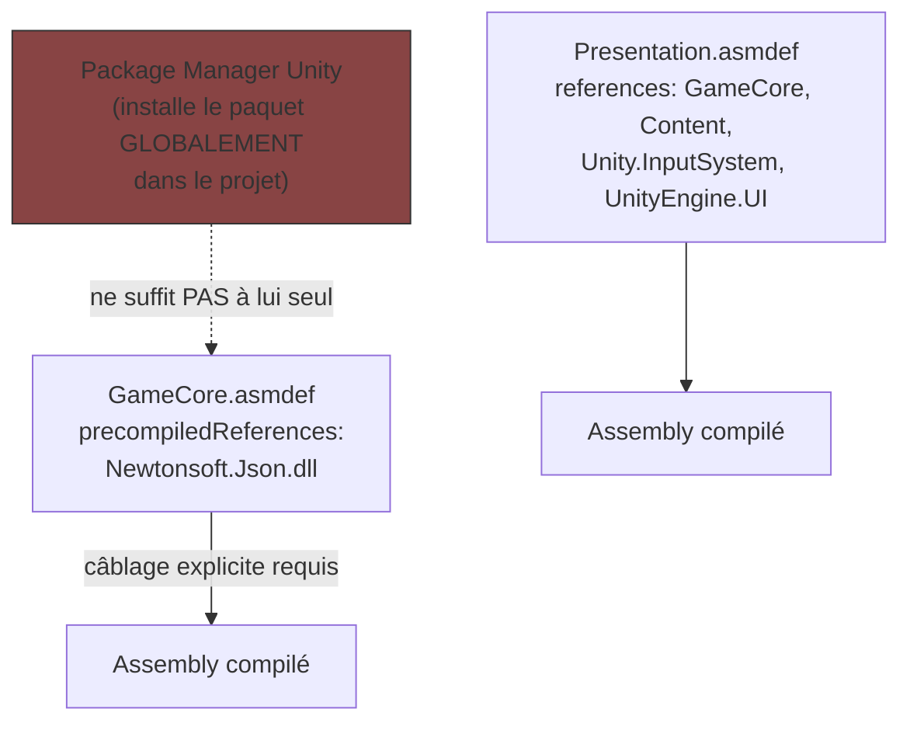

# Assembly Definition Files (.asmdef) — pourquoi installer un package ne suffit pas

> **Résumé (30 secondes)** : un `.asmdef` découpe le code Unity en **assemblies** (unités de compilation séparées) avec des frontières explicites. Installer un package (via le Package Manager) ne suffit pas : il faut **aussi** le référencer explicitement dans le `.asmdef` de l'assembly qui veut l'utiliser. Deux vrais bugs de cette session viennent exactement de cet oubli.

---

## Ancrage concret — l'appareil installé mais pas câblé

Installer un appareil électrique dans la maison (un package NuGet/Unity) ne suffit pas s'il n'est pas câblé jusqu'à la pièce qui en a besoin. Il faut **aussi tirer un câble** depuis le tableau jusqu'à la prise de cette pièce — c'est-à-dire ajouter la référence dans le `.asmdef` de l'assembly concerné. Un appareil livré mais jamais raccordé ne fonctionnera jamais, même s'il est bien dans la maison.

C'est exactement ce qui s'est passé cette session : le package Newtonsoft.Json n'était jamais arrivé « dans la maison » (jamais ajouté au manifest Unity), alors que `GameCore.asmdef` était déjà câblé pour l'attendre.

## Vue d'ensemble

Sans `.asmdef`, tout le code d'un projet Unity compile en un seul gros assembly (`Assembly-CSharp`) — lent à recompiler à chaque changement, et **aucune frontière imposée** entre GameCore/Content/Presentation (n'importe quel fichier peut référencer n'importe quel autre). Les `.asmdef` forcent la séparation décrite dans *Architecture en couches* à devenir une vraie contrainte de compilation, pas juste une convention de dossiers.

## Décomposition

1. **Ce qu'un `.asmdef` déclare** : le nom de l'assembly, les assemblies qu'il a le droit de référencer (`references`), les DLL externes précompilées (`precompiledReferences`, ex. `Newtonsoft.Json.dll`), les plateformes ciblées.
2. **Bug réel #1 de cette session** : `GameCore.asmdef` était déjà configuré pour attendre Newtonsoft.Json en `precompiledReferences` — mais le package `com.unity.nuget.newtonsoft-json` n'avait **jamais été ajouté au manifest Unity**. La référence pointait dans le vide. *Installer* le package (Package Manager) et *le référencer* (`.asmdef`) sont deux étapes distinctes, toutes les deux nécessaires.
3. **Bug réel #2, même famille** : `Presentation.asmdef` ne référençait pas `Unity.InputSystem` — même symptôme (types « introuvables » alors que le `using` est syntaxiquement correct).
4. **Règle de dépendance héritée de l'architecture** : `GameCore.asmdef` ne référence rien de Unity-spécifique ; `Content.asmdef` référence `GameCore` ; `Presentation.asmdef` référence `GameCore` + `Content` + les assemblies Unity nécessaires (voir *Architecture en couches*).
5. **Comment repérer ce bug** : le symptôme est toujours « ce type/cette classe est introuvable » dans la Console Unity, alors que le `using` semble correct — le réflexe à avoir est de vérifier les `references`/`precompiledReferences` du `.asmdef`, pas seulement le code.

## Théorie

C'est un cas particulier d'un concept plus général : la **modularisation par unité de compilation**. Chaque langage a son équivalent — en C#, les *namespaces* ne sont **pas** des frontières de compilation (deux classes dans des namespaces différents peuvent quand même se voir si elles sont dans le même assembly), contrairement aux assemblies elles-mêmes. Un `.asmdef` Unity est littéralement un fichier de configuration JSON qui devient un `.dll` séparé à la compilation.

## Pièges fréquents

- **Le piège central de cette session** : confondre « le package est installé » (visible dans le Package Manager) avec « le package est utilisable dans mon code » — il faut *aussi* l'ajouter aux `references`/`precompiledReferences` du `.asmdef` qui en a besoin.
- Ajouter une référence Unity-spécifique dans `GameCore.asmdef` « juste pour cette fois » → casse la compilabilité hors Unity (voir *Tester du code Unity hors Unity*).
- Une erreur trompeuse peut cacher la vraie cause : cette session, une erreur Burst sur le package Visual Scripting (« Failed to find entry-points ») semblait être LE problème — en réalité ce n'était qu'un symptôme secondaire, Newtonsoft manquant faisait déjà échouer `GameCore` avant même d'atteindre ce point. Retirer Visual Scripting (non utilisé par l'architecture) n'a eu aucun effet sur l'erreur réelle. **Toujours remonter à la première erreur chronologique, pas la plus visible.**
- **Bonus — ordre d'exécution des composants** : même une fois tous les assemblies bien câblés, Unity **ne garantit pas** l'ordre d'exécution entre les `Awake()`/`Start()` de différents `MonoBehaviour`. `GameBootstrap` (qui enregistre tous les services au démarrage) doit s'exécuter *avant* tout composant qui lit `GameServices` — forcé ici via `[DefaultExecutionOrder(-1000)]` (plus la valeur est basse, plus tôt le composant s'exécute). C'était un vrai bug latent, pas spécifique au harnais de test.

## Questions de rappel actif

1. Que se passe-t-il si un package est installé via le Package Manager mais jamais ajouté aux `references`/`precompiledReferences` d'un `.asmdef` ?
2. Pourquoi `GameCore.asmdef` n'a-t-il presque aucune référence ?
3. Quelle est la différence entre `references` et `precompiledReferences` dans un `.asmdef` ?
4. Pourquoi l'erreur Burst sur Visual Scripting était-elle une fausse piste, et comment l'a-t-on découvert ?
5. Pourquoi `GameBootstrap` a-t-il besoin de `[DefaultExecutionOrder(-1000)]` ?

## Connexions

- → [[Architecture-en-couches-GameCore-Content-Presentation]] — l'`.asmdef` est l'implémentation technique de cette séparation
- → [[Debogage-MSBuild-bin-obj-Directory-Build-props]] — autre catégorie de bug rencontrée dans le même arc de débogage réel
- → [[Tester-code-Unity-hors-Unity]] — la condition (GameCore sans dépendance Unity) qui permet ça
