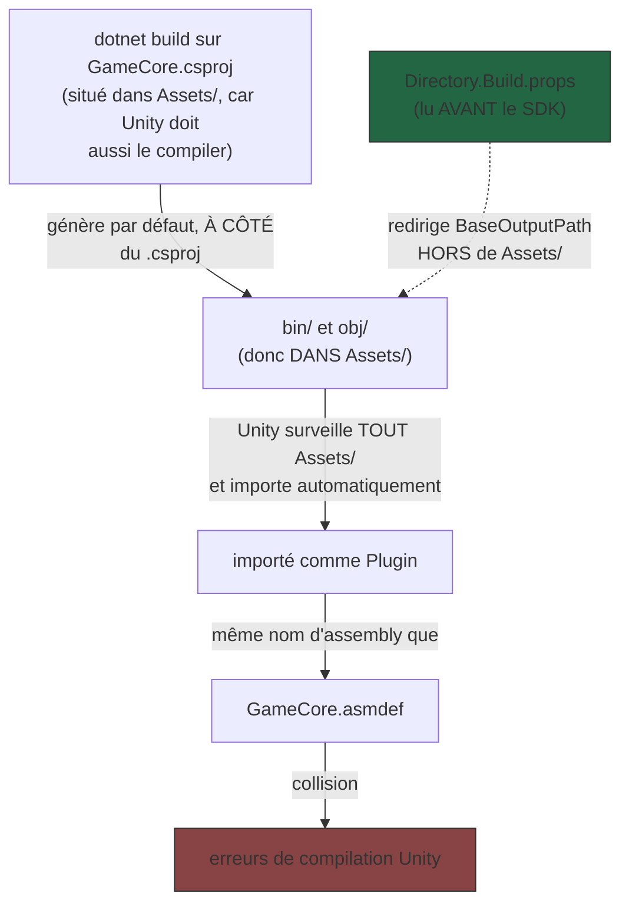

# Débogage MSBuild réel — bin/obj, Directory.Build.props, ordre d'import

> **Résumé (30 secondes)** : deux systèmes de build indépendants (`dotnet build` sur `GameCore.csproj`, et l'import automatique de fichiers d'Unity) sont entrés en collision parce que leurs dossiers de sortie (`bin/`, `obj/`) atterrissaient dans un dossier surveillé par l'autre (`Assets/`). `Directory.Build.props` (un fichier MSBuild lu **avant** le SDK du projet) est le bon endroit pour rediriger cette sortie. Cas d'école transférable à **tout** projet .NET, pas seulement Unity.

---

## Ancrage concret — deux tapis roulants qui se croisent

Deux usines tournent sur le même terrain : l'une (`dotnet build`) fabrique des caisses de sortie et les pose **juste à côté d'elle**, par défaut. L'autre (l'import automatique d'Unity) a un tapis roulant qui **ramasse absolument tout ce qui traîne** sur son terrain et l'embarque comme pièce détachée. Problème : la première usine a posé ses caisses *sur* le terrain surveillé par la seconde, qui les a donc embarquées par erreur — provoquant une collision avec une pièce déjà montée ailleurs (le même assembly, sous deux formes différentes).

## Vue d'ensemble

Ce bug s'est produit **après** la fin de la phase Gameplay Programmer, à la toute première ouverture réelle du projet dans Unity par mentalyas — le genre de bug qu'un agent sans éditeur ne pouvait tout simplement pas voir à l'avance.

## Décomposition

1. **Le symptôme observé** : erreurs de compilation Unity liées à un conflit d'assembly portant le même nom que `GameCore.asmdef`.
2. **La cause réelle** : `dotnet build` sur `GameCore.csproj` (utilisé pour tester hors Unity, voir *Tester du code Unity hors Unity*) génère par défaut `bin/` et `obj/` **à côté** du `.csproj` — qui se trouve être **dans** `Assets/` (parce que `GameCore.asmdef` doit être sous `Assets/` pour qu'Unity le compile aussi). Unity surveille tout `Assets/` et importe automatiquement chaque fichier trouvé, y compris les `.dll` de sortie du build .NET, comme s'il s'agissait d'un Plugin fourni par l'utilisateur.
3. **Pourquoi `Directory.Build.props` et pas juste une propriété dans le `.csproj`** : MSBuild (le système de build sous-jacent à `dotnet build`) charge `Directory.Build.props` **automatiquement, avant même le SDK du projet** (`Microsoft.NET.Sdk`), en remontant l'arborescence de dossiers depuis le `.csproj`. Une propriété écrite directement dans le `.csproj` est lue **après** que le SDK a déjà posé ses valeurs par défaut (dont l'emplacement par défaut de `bin`/`obj`) — trop tard pour certains réglages.
4. **La correction appliquée** : un `Directory.Build.props` qui redirige `BaseOutputPath`/`BaseIntermediateOutputPath` (les propriétés MSBuild qui contrôlent où vont `bin/` et `obj/`) vers un dossier hors de `Assets/`.
5. **La fausse piste instructive** : une erreur Burst trompeuse (« Failed to find entry-points » sur `Assembly-CSharp-Editor`) semblait être LA cause, à cause du package Visual Scripting installé. En réalité ce n'était qu'un **symptôme secondaire** — le vrai bug (Newtonsoft.Json manquant, voir *Assembly Definition Files*) faisait déjà échouer `GameCore` avant même d'atteindre ce point. Retirer Visual Scripting (non utilisé par l'architecture, tout étant codé à la main) n'a eu aucun effet sur l'erreur réelle.

## En pratique — le déroulé réel de la session

Le projet Unity avait d'abord été créé par erreur hors du dépôt (`C:\Users\ernes\My project`), puis déplacé et fusionné proprement dans `src/UnityProject/`. Les bugs ont été corrigés un par un, **en lisant la Console Unity dans l'ordre**, pas en sautant vers le message le plus alarmant. Fin de session : Console à 0 erreur / 0 warning, prêt pour le premier vrai playtest.

## Théorie

C'est un cas d'école transférable à **tout** projet .NET, pas seulement Unity : dès que deux systèmes de build partagent un dossier surveillé par l'un et écrit par l'autre, ce type de collision peut survenir (ex. un outil de bundling web qui scanne un dossier où atterrissent aussi des artefacts de build .NET). La leçon générale MSBuild : l'ordre de chargement des fichiers de configuration — `Directory.Build.props` → SDK → `.csproj` → `Directory.Build.targets` — détermine **quand** une propriété peut encore influencer le résultat. Une propriété définie trop tard dans cet ordre ne peut plus changer un défaut déjà appliqué plus tôt.

## Pièges fréquents

- Chercher la cause dans le message d'erreur le plus visible/récent (ici : Burst/Visual Scripting) plutôt que dans la **première** erreur chronologique — la vraie cause était plus en amont.
- Placer un projet .NET annexe (ici `GameCore.csproj`) dans un dossier surveillé par un autre outil, sans réfléchir à où atterrissent ses fichiers de sortie.
- Essayer de fixer l'emplacement de `bin`/`obj` directement dans le `.csproj`, sans savoir que le SDK a peut-être déjà posé ses valeurs par défaut avant que cette ligne soit lue — d'où l'intérêt de `Directory.Build.props`.

## Questions de rappel actif

1. Pourquoi `dotnet build` a-t-il pollué `Assets/` avec des fichiers qu'Unity a mal interprétés ?
2. Pourquoi `Directory.Build.props` fonctionne-t-il là où une propriété dans le `.csproj` aurait pu échouer ?
3. Dans quel ordre MSBuild charge-t-il ses fichiers de configuration ?
4. Pourquoi retirer le package Visual Scripting n'a-t-il pas résolu l'erreur réelle ?
5. Si demain un autre outil (linter, bundler web) scanne un dossier où atterrissent aussi des artefacts de build .NET, quel type de problème faut-il anticiper ?

## Connexions

- → [[Assembly-Definition-Files-asmdef]] — le conflit se manifeste comme une collision de nom d'assembly
- → [[Tester-code-Unity-hors-Unity]] — c'est la coexistence de `GameCore.csproj` à côté du projet Unity qui a créé ce risque
