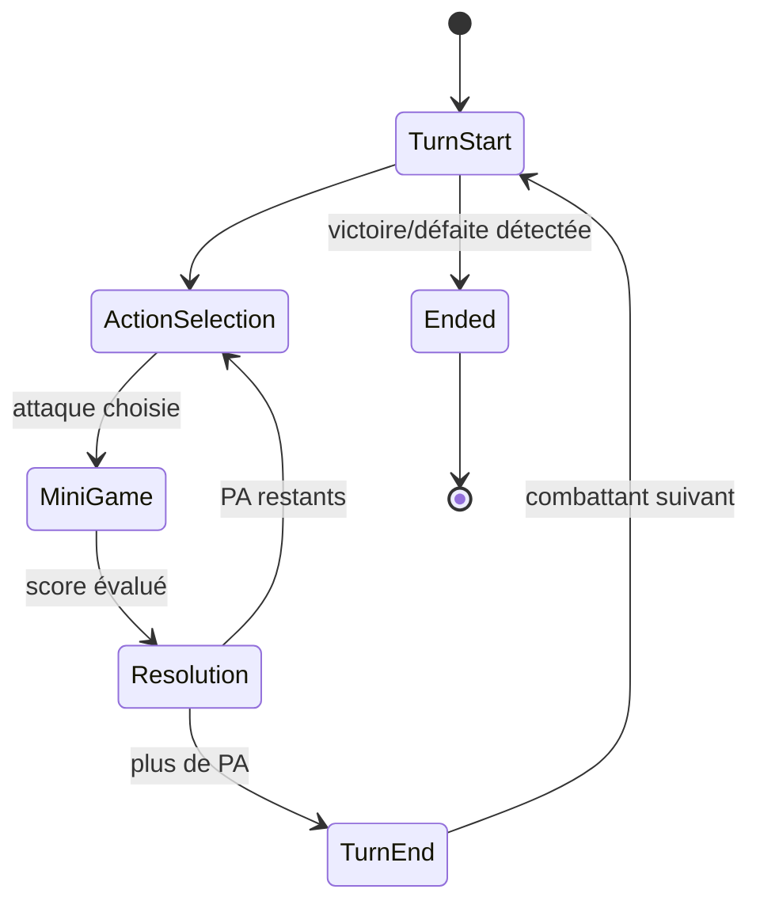

# FSM par classes d'état — pourquoi pas un switch géant

> **Résumé (30 secondes)** : une FSM (Finite State Machine — machine à états finis, un système qui n'est jamais que dans **un seul état à la fois** et qui passe d'un état à l'autre selon des règles précises) découpe un flux (ex. un tour de combat) en états distincts, **chacun étant une vraie classe** qui sait ce qu'elle doit faire en y entrant — plutôt qu'un immense `switch` qui grossit à chaque nouvelle règle.

---

## Ancrage concret — la fiche recette découpée en étapes

Une recette de cuisine en plusieurs étapes fixes (préparer les ingrédients → cuire → dresser → servir) : chaque étape a un début clair, une action précise, et sait quelle est l'étape suivante. Une FSM par classes d'état, c'est **une fiche séparée par étape** au lieu d'un seul texte géant truffé de « si tu en es à l'étape 3, alors fais ceci, sauf si... » partout mélangé — c'est ce mélange-là qui correspond au `switch` géant qu'on évite.

Dans le projet : `TurnStartState`, `ActionSelectionState`, `MiniGameState`, `ResolutionState`, `TurnEndState`, `EndedState` sont six fiches séparées, chacune sachant exactement quoi faire à son entrée.

## Vue d'ensemble

Le combat tactique était identifié dès la phase Game Designer comme **le système CORE le plus lourd** (complexité 5/5) du projet. Sa FSM de tour (Idle → sélection action → mini-jeu → résolution → tour suivant) est l'endroit où ce choix d'implémentation compte le plus.

## Décomposition

1. **Le problème du switch géant** : `switch(currentState) { case TurnStart: ... case MiniGame: ... }` grossit indéfiniment à chaque nouvel effet de combat ajouté, risque d'oublier un `case`, mélange la logique de plusieurs états dans une seule méthode.
2. **La solution par classes d'état** : une interface commune `ICombatState` avec `Enter(CombatStateMachine)`. Chaque état concret (`TurnStartState`, `ActionSelectionState`, `MiniGameState`, `ResolutionState`, `TurnEndState`, `EndedState`) est une classe séparée.
3. **L'orchestrateur** : `CombatStateMachine` détient l'état courant et gère les transitions explicites (`StartCombat()`, `SubmitMove()`, `SubmitAttack()`, `ResolveMiniGame(...)`) — c'est le **seul** endroit qui décide de l'état suivant.
4. **Polymorphisme au lieu de branchement** : appeler `currentState.Enter(this)` dispatche automatiquement vers le bon code, sans jamais tester « si je suis dans tel état, alors... ».
5. **Deux FSM dans le projet, même principe à deux échelles** : `GameStateMachine` (niveau application : Boot/Hub/Crafting/Combat) et `CombatStateMachine` (niveau d'un combat : tour par tour).

## En pratique

`CombatStateMachineTests.cs` couvre 12 cas réels : démarrage en sélection d'action, déplacement invalide (PM insuffisants), attaque hors de portée rejetée, victoire/défaite, garde-fou sur une transition invalide (ex. bouger pendant la résolution du mini-jeu).

**Bug réel trouvé et corrigé par ces tests** : `AggressiveAI`, une fois à portée d'attaque mais sans PA (points d'action) restants après une première attaque dans le même tour, continuait à évaluer « je dois me rapprocher » et se déplaçait **sur la case occupée par sa propre cible**, provoquant une exception. Corrigé : une fois à portée, l'IA n'essaie plus jamais de se déplacer.

## Théorie

La FSM est un modèle de calcul classique en informatique théorique : un système avec un nombre fini d'états, des entrées qui déclenchent des transitions, un seul état actif à la fois. L'implémentation « par classes d'état » est le pattern **State** (catalogue « Gang of Four ») — chaque état est un objet, la transition = remplacer la référence vers l'objet état courant, au lieu de faire évoluer une variable `enum` interprétée par un `switch`.

## Pièges fréquents

- Ajouter une nouvelle transition en dur dans plusieurs états différents plutôt que centraliser la décision dans l'orchestrateur (`CombatStateMachine`) → logique de transition éparpillée.
- Oublier un garde-fou sur une transition invalide (ex. bouger pendant la résolution du mini-jeu) → doit être explicitement rejeté, jamais juste ignoré silencieusement.
- **Le piège général révélé par le bug de l'IA** : une condition liée à l'état (« ai-je encore des PA ? ») qui n'est pas **re-testée à chaque étape** peut rester vraie dans la tête du code alors qu'elle a changé dans les faits.

## Questions de rappel actif

1. Pourquoi remplacer un `switch` géant par des classes d'état réduit-il le risque de bug à l'ajout d'un nouvel effet de combat ?
2. Qui décide de la transition d'un état à l'autre — l'état lui-même ou l'orchestrateur (`CombatStateMachine`) ?
3. Que fait `Enter(CombatStateMachine)`, et pourquoi ça remplace le `switch` ?
4. Pourquoi une transition invalide (bouger pendant la résolution) doit-elle être explicitement rejetée plutôt qu'ignorée ?
5. Quelle est la différence d'échelle entre `GameStateMachine` et `CombatStateMachine` ?

## Connexions

- → [[Patterns-Strategy-Factory-Registry]] — le pattern State est un cousin du pattern Strategy (même mécanique de polymorphisme, but différent : état interne vs comportement interchangeable)
- → [[Architecture-en-couches-GameCore-Content-Presentation]] — les deux FSM vivent entièrement dans GameCore
- → [[Tester-code-Unity-hors-Unity]] — les 12 tests `CombatStateMachine` ont trouvé le bug `AggressiveAI` par exécution réelle, pas par relecture
