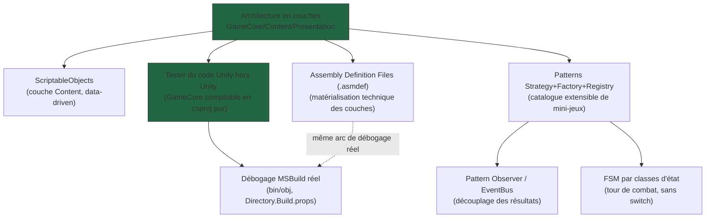

# MOC — Jeu Vidéo Personnel (craft incrémental)

> **Résumé (30 secondes)** : jeu mobile Unity/C# hybride craft-gestion-automatisation + combat tactique tour par tour, où chaque action clé est validée par un mini-jeu de dextérité/précision/logique plutôt qu'un jet de dés. Session 1 (2026-09-15) : brainstorm → pipeline Game Dev complet (Design → Architecture → Implémentation) → première ouverture réelle dans Unity 6 avec débogage en direct. Cette session a posé **8 concepts fondamentaux**, tous réutilisables bien au-delà de ce projet.

---

## Le projet en une phrase

Jeu mobile (iOS + Android) où l'habileté réelle du joueur — pas le hasard — détermine la qualité de chaque craft, raffinage et action de combat, via un système de mini-jeux transversal et extensible. Développé solo en Unity/C#, avec intention de recruter des collaborateurs (d'où l'insistance forte sur une architecture orientée objet et un contenu data-driven, pensés dès le départ pour être étendus par d'autres).

## Ce qui s'est passé cette session

1. **Brainstorm niveau 1** → `docs/FOUNDATION.md` (concept, 7 systèmes core, économie F2P type Warframe, risques légaux notés).
2. **Pipeline Game Dev supervisé**, Phases 1 à 3 :
   - **Game Designer** — GDD, 4 pillars, priorisation CORE/IMPORTANT.
   - **Technical Director** — architecture en couches, patterns d'extensibilité, ScriptableObjects. *(le cœur technique de cette session — voir notes ci-dessous)*
   - **UI/UX + World Builder** (en parallèle) — écrans, feedback, structure hub-and-spoke.
   - **Gameplay Programmer** — vertical slice codé, **GameCore réellement compilé et testé** (75 fichiers, 35 tests, 2 bugs réels trouvés et corrigés) avant même d'avoir un éditeur Unity sous la main.
3. **Première ouverture réelle du projet dans Unity 6**, avec débogage en direct de plusieurs bugs invisibles pour un agent sans éditeur (package manquant, référence d'assembly manquante, conflit de build, ordre d'exécution non garanti) — **la partie la plus riche en enseignements transférables** de la session.

## Les 8 notes de cette session

| Note | En une phrase |
|---|---|
| [[Architecture-en-couches-GameCore-Content-Presentation]] | Séparer la logique pure (GameCore) des données (Content) et de l'affichage (Presentation), avec une règle de dépendance à sens unique — la fondation dont dépend tout le reste. |
| [[ScriptableObjects-Data-Driven]] | Des fiches de données éditables dans Unity qui portent le contenu (recettes, ennemis, mini-jeux) sans aucune logique — pour qu'un designer ajoute du contenu sans toucher au code. |
| [[Assembly-Definition-Files-asmdef]] | Les `.asmdef` matérialisent techniquement les couches en unités de compilation séparées — installer un package ne suffit pas, il faut aussi le référencer. |
| [[Patterns-Strategy-Factory-Registry]] | Le trio qui rend le catalogue de mini-jeux extensible : une classe + une ligne d'enregistrement suffit à ajouter un type sans toucher au reste. |
| [[Pattern-Observer-EventBus]] | Un bus d'événements central qui découple la logique (qui publie) de l'UI/audio/analytics (qui écoutent) — sauf pour le flux d'input continu, qui doit rester local. |
| [[FSM-par-classes-etat]] | Le tour de combat est une machine à états implémentée par des classes d'état plutôt qu'un switch géant — plus sûr à faire évoluer. |
| [[Tester-code-Unity-hors-Unity]] | GameCore, sans dépendance Unity, se compile et se teste comme un projet .NET normal — 2 vrais bugs trouvés avant même d'ouvrir Unity. |
| [[Debogage-MSBuild-bin-obj-Directory-Build-props]] | Le cas d'école du débogage MSBuild réel (bin/obj, Directory.Build.props, ordre de chargement) — transférable à tout projet .NET, pas seulement Unity. |

## Comment lire ce module (ordre recommandé)

1. Commence par **Architecture en couches** — c'est la fondation, tout le reste en dépend.
2. Puis **ScriptableObjects** et **Assembly Definition Files** — les deux implémentations concrètes de cette architecture (donnée / compilation).
3. Puis **Strategy+Factory+Registry**, **Observer/EventBus** et **FSM par classes d'état** — les patterns qui vivent *dans* GameCore.
4. Termine par **Tester Unity hors Unity** et **Débogage MSBuild** — le passage du code écrit au code qui tourne vraiment, avec les vrais bugs rencontrés en ouvrant le projet.

Voir aussi le canvas [[jeu-video-personnel-craft-incremental — Reseau.canvas]] pour ce même flux en visuel.

## Points volontairement non couverts par une note dédiée

- **Détails de syntaxe mineurs** (avertissements `CS8632` liés à `#nullable enable` manquant, champ mort `_isolatedCanvas`, `using` manquant dans `CraftManualController.cs`) — trop ponctuels pour justifier une note, mentionnés ici pour mémoire.
- **Les 3 itérations de débogage du harnais de test Editor** (`TestHarnessSetup.cs` : API `.inputactions`, corruption de sous-asset par `AddObjectToAsset`, destruction d'assets en mémoire par `EditorSceneManager.NewScene`) — épisode réel et instructif, mais spécifique aux API d'édition Unity (Editor scripting), avec une transférabilité plus faible que les 8 notes ci-dessus. À couvrir dans une future session si ce type de script Editor personnalisé revient.

## Connexions vers le reste du projet

- `docs/FOUNDATION.md`, `docs/brainstorm/L1-fondation.md` — le cahier des charges d'origine.
- `docs/ARCHITECTURE.md`, `docs/IMPLEMENTATION.md` — les livrables techniques source de ces notes.
- `graphify-out/GRAPH_REPORT.md` — le graphe de connaissances du code réel (communautés « Interfaces & Patterns GameCore », « Résolution Actions de Combat », etc.).
- `docs/JOURNAL.md` — le journal de session complet, entrée par entrée d'agent.
