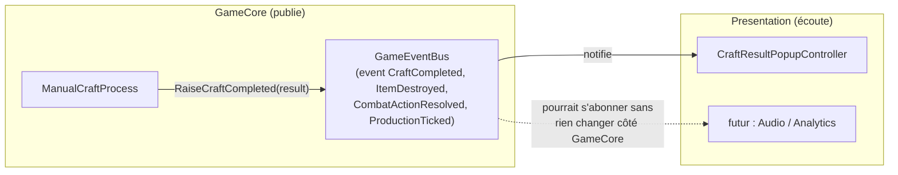

# Pattern Observer — le GameEventBus

> **Résumé (30 secondes)** : le `GameEventBus` est un point central qui diffuse les événements de jeu (fin de craft, item détruit, résolution de combat…) à tous ceux qui veulent les écouter, sans que la logique métier sache qui écoute. Règle apprise cette session : le flux d'input **continu** (position tactile à chaque frame) ne doit JAMAIS passer par ce bus.



---

## Ancrage concret — le convoyeur central de l'usine

Imagine une usine qui balance ses produits finis sur **un convoyeur central**. N'importe quelle machine branchée sur ce convoyeur peut prendre ce qui l'intéresse, sans que l'usine productrice sache qui prend quoi — ni même si quelqu'un prend quelque chose du tout. Demain, on peut brancher une nouvelle machine (un système d'analytics) sur le même convoyeur sans toucher à l'usine.

Dans le projet : `ManualCraftProcess` (l'usine) lève `CraftCompleted` sur le bus sans savoir qu'une popup UI (`CraftResultPopupController`) l'écoute — ni combien d'autres systèmes l'écoutent.

## Vue d'ensemble

Sans ce mécanisme, la logique métier (craft, combat) devrait connaître directement chaque système intéressé par ses résultats (UI, audio, inventaire, futur système d'analytics) — un couplage qui explose à chaque nouvel ajout. Le bus casse ce couplage.

## Décomposition

1. **Le problème résolu** : découpler « qui produit un événement » de « qui réagit à cet événement ».
2. **Le mécanisme C#** : un `event Action<T>` par type d'événement, plus une méthode `Raise...` qui invoque l'event si quelqu'un est abonné :
   ```csharp
   public event Action<CraftResult> CraftCompleted;
   public void RaiseCraftCompleted(CraftResult result) => CraftCompleted?.Invoke(result);
   ```
3. **Qui publie, qui écoute** : GameCore publie (`ManualCraftProcess` lève `CraftCompleted`), Presentation écoute (`CraftResultPopupController` s'abonne).
4. **La règle stricte apprise cette session** : le flux d'input **continu** du mini-jeu (position tactile lue à chaque frame) ne passe **jamais** par le bus — il est lu directement, en local, pour rester sous la contrainte de latence perçue (< 100ms). Le bus est réservé aux événements de **résultat / fin d'action**, pas au flux continu haute fréquence.
5. **Ce que ça permet d'ajouter plus tard sans rien casser** : analytics, télémétrie, nouveaux effets sonores — n'importe quel nouvel abonné, zéro modification de `ManualCraftProcess` ou `CombatStateMachine`.

## En pratique

`GameCore/Events/GameEventBus.cs` expose 4 events : `CraftCompleted`, `ItemDestroyed`, `CombatActionResolved`, `ProductionTicked`. Côté Presentation, `CraftResultPopupController` s'abonne et définit `HapticPattern.DestructiveFailure` comme **constante unique réutilisée partout** (jamais dupliquée) — une exigence explicite de l'agent UI/UX pour garantir que l'échec destructif reste toujours reconnaissable.

## Théorie

Pattern **Observer** classique (catalogue « Gang of Four ») : un sujet maintient une liste d'observateurs et les notifie sans connaître leur type concret. En C#, `event`/`Action<T>` est l'implémentation native du langage (le compilateur génère l'équivalent d'une liste de délégués avec `+=`/`-=`). La variante « Event Bus » centralise ça en un point unique plutôt que d'éparpiller un `event` par petit objet — utile quand plusieurs systèmes indépendants doivent réagir aux mêmes événements globaux.

## Pièges fréquents

- Utiliser le bus pour un flux haute fréquence (input continu) → latence perceptible. C'est exactement l'erreur que la contrainte < 100ms de cette session interdit.
- Oublier de se désabonner (`-=`) quand un objet Presentation est détruit → fuite mémoire ou callback appelé sur un objet mort (piège classique des `event` C#).
- Mettre de la logique dans le handler qui devrait vivre dans GameCore (ex. calculer un résultat dans le popup UI) → fait fuir la logique métier vers la présentation, contredit toute l'architecture en couches.

## Questions de rappel actif

1. Pourquoi `RaiseCraftCompleted` utilise `?.Invoke` et pas simplement `Invoke` ?
2. Pourquoi le flux d'input du mini-jeu ne doit-il jamais transiter par le bus ?
3. Quel est le risque si un objet Presentation oublie de se désabonner d'un event avant d'être détruit ?
4. Qui a le droit de lever (`Raise`) un événement — GameCore ou Presentation ?
5. Si tu ajoutes un système d'analytics demain, dois-tu modifier `ManualCraftProcess` ?

## Connexions

- → [[Patterns-Strategy-Factory-Registry]] — autre mécanisme de découplage complémentaire
- → [[Architecture-en-couches-GameCore-Content-Presentation]] — le bus vit dans GameCore, les abonnés dans Presentation
