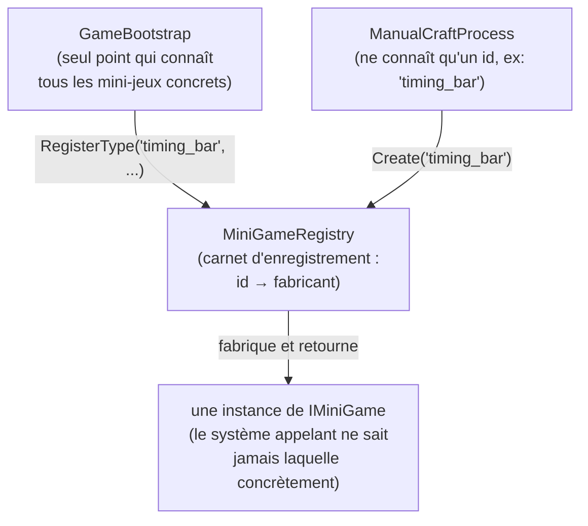

# Le trio Strategy + Factory + Registry — catalogue extensible de mini-jeux

> **Résumé (30 secondes)** : trois patterns combinés permettent d'ajouter un nouveau mini-jeu (ou ennemi, ou item) en écrivant **une seule classe + une ligne d'enregistrement**, sans jamais toucher au code déjà existant. C'est ce qui a permis de réutiliser tel quel le mini-jeu de craft pour le combat — preuve concrète que ça marche.



---

## Ancrage concret — la chaîne d'assemblage à recettes interchangeables

Imagine une usine avec **un trieur sur convoyeur** (le *Registry*) : chaque colis (une requête) porte une étiquette (un id, ex. `"timing_bar"`). Le trieur redirige le colis vers **la bonne machine** (la *Factory*) sans que le reste de l'usine sache comment cette machine fonctionne à l'intérieur. Chaque machine suit **une recette interchangeable** (la *Strategy*) — on peut remplacer la recette d'une machine, ou ajouter une machine entièrement nouvelle sur le convoyeur, sans redessiner toute l'usine.

Dans le projet : le craft manuel demande un mini-jeu par son id (`"timing_bar"`), sans jamais savoir que la classe concrète s'appelle `TimingBarMiniGame`.

## Vue d'ensemble

Ce trio résout un problème précis identifié dès la phase Game Designer : le catalogue de mini-jeux (dextérité, timing, logique…) **sera itéré plusieurs fois après les premiers tests joueurs** — l'architecture doit encaisser ces ajouts sans jamais être réécrite.

## Décomposition

1. **Strategy** — une interface commune, `IMiniGame` (`Initialize`, `OnInputSample`, `IsComplete`, `Evaluate()`), que chaque type de mini-jeu implémente différemment. Les systèmes appelants ne parlent qu'à l'interface, jamais à un type concret.
2. **Factory** — `IMiniGameFactory.Create(string id)` : fabrique une instance concrète à partir d'un identifiant. Résout un id vers une instance, sans `switch`.
3. **Registry** — `MiniGameRegistry` : un dictionnaire `id → constructeur`, rempli **une seule fois**, au démarrage, dans `GameBootstrap` :
   ```csharp
   miniGameRegistry.RegisterType("timing_bar", () => new TimingBarMiniGame());
   miniGameRegistry.RegisterType("trace_precision", () => new TracePrecisionMiniGame());
   GameServices.Register<IMiniGameFactory>(miniGameRegistry);
   ```
4. **Le système appelant ne connaît jamais le type concret** — seulement l'interface, et un id qui vient de la donnée (`MiniGameConfigSO`, voir *ScriptableObjects*).
5. **Coût d'ajout d'un nouveau mini-jeu** = 1 classe qui implémente `IMiniGame` + 1 ligne dans `GameBootstrap`. Zéro modification du craft, du raffinage ou du combat.

## En pratique — la preuve par la réutilisation

Le mini-jeu `TimingBarMiniGame`, écrit et testé en premier pour le craft manuel, a été **réutilisé tel quel** pour l'action de combat, simplement en l'enregistrant sous un second id. C'est la démonstration concrète que le pattern tient sa promesse d'extensibilité, pas juste une intention sur le papier.

## Théorie

Ce trio est un classique des patterns de conception catalogués par le « Gang of Four » (livre de référence des années 90) :
- **Strategy** = comportement interchangeable au runtime, derrière une interface commune.
- **Factory** = déléguer la création d'un objet à une méthode dédiée plutôt que faire `new ClasseConcrète()` partout dans le code.
- **Registry** (proche du *Service Locator* ici, via `GameServices`) = une table de correspondance centralisée entre un identifiant et une implémentation.

Ensemble, ils forment un mécanisme d'extension « par plugin », qui respecte le principe **ouvert à l'extension, fermé à la modification** (on ajoute du code, on n'en modifie pas).

## Pièges fréquents

- Remplacer le Registry par un gros `switch`/`if` « pour aller plus vite » — ça marche au début, mais chaque nouvel ajout oblige à modifier du code déjà existant (risque d'oubli).
- Laisser un système appelant caster vers le type concret « juste cette fois » — brise l'invariant « aucun type concret en dehors de `GameBootstrap` ».
- Oublier d'enregistrer un nouveau type dans `GameBootstrap` → doit produire une **erreur explicite** (id inconnu), jamais un échec silencieux — c'est un cas de test dédié dans le projet (`MiniGameRegistryTests`).

## Questions de rappel actif

1. Quelle est la différence de responsabilité entre la Factory et le Registry ?
2. Pourquoi le Registry doit-il lever une erreur explicite plutôt que retourner `null` sur un id inconnu ?
3. Où et à quel moment les enregistrements (`RegisterType`) ont-ils lieu, et pourquoi à un seul endroit ?
4. Si tu ajoutes un mini-jeu `LogicRoutingMiniGame`, quelles sont les deux seules choses à faire ?
5. En quoi la réutilisation du mini-jeu de craft pour le combat prouve-t-elle que le pattern fonctionne vraiment ?

## Connexions

- → [[Architecture-en-couches-GameCore-Content-Presentation]] — ce trio vit entièrement dans GameCore
- → [[Pattern-Observer-EventBus]] — mécanisme de découplage complémentaire (résultats vs création)
- → [[ScriptableObjects-Data-Driven]] — la donnée qui porte l'id que la Factory résout
- → [[FSM-par-classes-etat]] — autre exemple de polymorphisme qui remplace un switch géant
