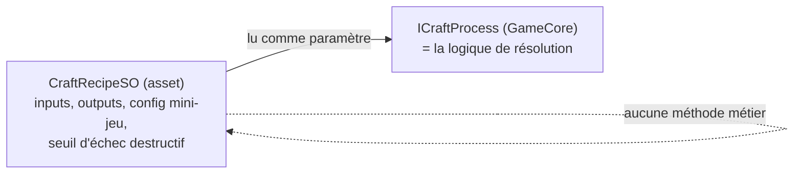

# ScriptableObjects — la couche de contenu data-driven

> **Résumé (30 secondes)** : les `ScriptableObject` sont des fiches de données éditables dans Unity (recette de craft, définition d'ennemi, config de mini-jeu…) qui ne contiennent **aucune logique**. Un designer (ou mentalyas lui-même, plus tard un collègue) peut ajouter du contenu en créant un asset dans l'éditeur, sans jamais écrire une ligne de C#.

---

## Ancrage concret — le classeur de recettes du restaurant

Un restaurant sépare **le classeur de recettes** (le contenu) de **la cuisine** (l'équipement qui exécute les recettes). Un nouveau chef peut ajouter une fiche recette dans le classeur — quantités, temps de cuisson, présentation — **sans avoir besoin de savoir comment fonctionne la plaque de cuisson**. La plaque (le moteur de résolution en C#, dans GameCore) reste la même, quel que soit le nombre de fiches ajoutées.

Dans le projet : `CraftRecipeSO` est une fiche recette. `ManualCraftProcess` (GameCore) est la plaque de cuisson qui la lit et l'exécute.

## Vue d'ensemble

Sans cette couche, ajouter une recette de craft obligerait à modifier du code C#, recompiler, et risquer de casser autre chose. C'est le **deuxième pilier explicite** demandé par mentalyas lors de la phase d'architecture, au même niveau d'importance que la séparation en couches.

## Décomposition

1. **Le problème** : séparer les règles (le code, qui change rarement) des données (le contenu, qui change souvent).
2. **La solution Unity** : `ScriptableObject` est une classe C# qui hérite de `ScriptableObject` (pas de `MonoBehaviour`) — elle existe comme **asset éditable**, indépendamment de toute scène de jeu.
3. **La règle stricte du projet** : un `ScriptableObject` expose **uniquement des données** (champs), jamais de logique métier au-delà de la simple validation de champs. La résolution reste dans `GameCore`, qui **lit** le SO comme un paramètre.
4. **Les 5 ScriptableObjects du projet**, chacun miroir d'un POCO (Plain Old C# Object — objet C# simple sans logique) de `GameCore` :

   | ScriptableObject | Contenu | Consommé par |
   |---|---|---|
   | `MiniGameConfigSO` | id du mini-jeu, courbe de difficulté, seuils de qualité | `IMiniGameFactory` |
   | `CraftRecipeSO` | inputs, outputs, config mini-jeu, flag échec destructif | `ICraftProcess` |
   | `ItemDefinitionSO` | type, rareté, stats de base | `IItemFactory` |
   | `CombatantDefinitionSO` | stats, id d'IA, loot table | `ICombatantFactory` |
   | `ProductionNodeSO` | taux de production, cap de stockage | `IProductionNode` |

5. **Chargement via Addressables** (système Unity de chargement asynchrone par adresse) plutôt que le dossier `Resources/` (approche historique, dépréciée en bonnes pratiques) — meilleur contrôle mémoire sur mobile, et surtout possibilité d'ajouter du contenu après le lancement sans resoumission complète au store.

## Théorie

C'est une application du principe général **Data-Driven Design** : séparer les règles du contenu pour qu'un non-développeur puisse itérer sur le jeu sans toucher au code. Unity formalise ce principe via `ScriptableObject` — un objet sérialisé indépendant d'une scène, contrairement à un `Component` qui vit forcément attaché à un `GameObject` en scène.

## Pièges fréquents

- **Le piège classique explicitement documenté dans ce projet** : mettre une méthode avec de la logique métier dans un `ScriptableObject` « parce que c'est pratique, proche de la donnée » → rend cette logique impossible à tester hors éditeur, contredit toute la couche GameCore testable (voir *Tester du code Unity hors Unity*).
- Charger par réflexe via le dossier `Resources/` (vieille habitude Unity) au lieu d'Addressables.
- Oublier que `Content.asmdef` référence `GameCore.asmdef` (pour connaître les types de données) — le sens de dépendance doit rester respecté (voir *Architecture en couches*).

## Questions de rappel actif

1. Qu'est-ce qui distingue un `ScriptableObject` d'un `MonoBehaviour` classique ?
2. Pourquoi un `ScriptableObject` ne doit-il jamais contenir de logique de résolution ?
3. Qui lit `CraftRecipeSO`, et dans quelle couche vit ce code ?
4. Pourquoi Addressables plutôt que le dossier `Resources/` ?
5. Si mentalyas recrute un game designer sans compétence C#, quelle partie du projet peut-il modifier seul, et pourquoi ?

## Connexions

- → [[Architecture-en-couches-GameCore-Content-Presentation]] — Content est la couche du milieu
- → [[Patterns-Strategy-Factory-Registry]] — l'id porté par le SO est ce que la Factory résout
- → [[Assembly-Definition-Files-asmdef]] — `Content.asmdef`
