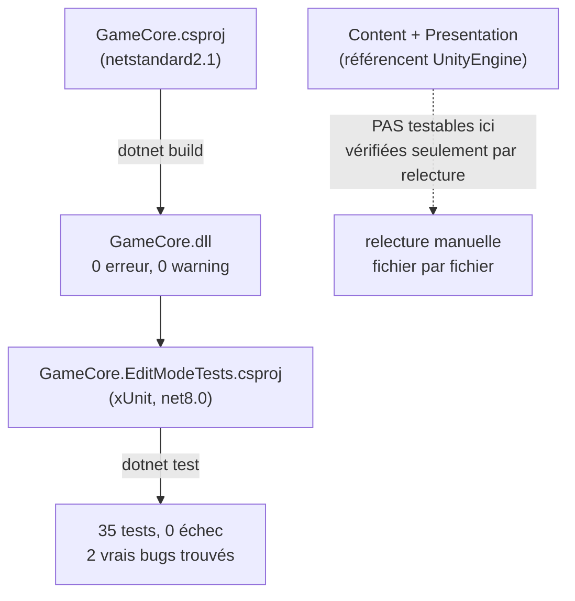

# Tester du code Unity hors Unity — GameCore comme projet .NET autonome

> **Résumé (30 secondes)** : parce que `GameCore` ne référence aucune API Unity, il peut être compilé et testé comme un projet .NET ordinaire (`dotnet build` / `dotnet test`), **sans jamais ouvrir l'éditeur Unity**. Cette session, ça a permis de compiler 75 fichiers, faire passer 35 tests, et trouver 2 vrais bugs **avant même la première ouverture réelle du projet dans Unity**.



---

## Ancrage concret — tester la recette avant l'ouverture du restaurant

Un chef teste une nouvelle recette sur une plaque de cuisson ordinaire à la maison, avant même d'avoir accès à la cuisine du restaurant (Unity) — parce que la recette elle-même (GameCore) n'a besoin d'aucun équipement spécifique au restaurant. Ça permet de valider le goût (la logique) bien avant l'ouverture, avec un aller-retour bien plus rapide qu'en conditions réelles.

## Vue d'ensemble

Cette session, le Gameplay Programmer a implémenté tout le vertical slice (craft manuel + combat tactique) dans un environnement **sans Unity installé**. Grâce à la séparation en couches (voir *Architecture en couches*), la partie la plus critique du jeu (`GameCore`) a quand même pu être **réellement compilée et testée**, pas juste écrite « en espérant que ça marche ».

## Décomposition

1. **Pourquoi c'est possible** : `GameCore` = C# pur, donc compilable par n'importe quel compilateur .NET, pas seulement celui embarqué dans Unity.
2. **Le montage technique** : un `GameCore.csproj` (`netstandard2.1` — une version de bibliothèque de classes .NET compatible à la fois avec Unity et avec .NET « normal ») posé à côté du code, plus un projet de tests séparé (`GameCore.EditModeTests.csproj`, xUnit, `net8.0`).
3. **Ce que ça a concrètement prouvé cette session** : `dotnet build` → 0 erreur, 0 warning. `dotnet test` → 35 tests passés, réparti sur mini-jeux, craft, combat, inventaire, production offline, sauvegarde. **2 vrais bugs trouvés** par l'exécution (seuil de succès du mini-jeu mal calculé, IA qui se déplace sur la case de sa propre cible) — preuve que l'exécution réelle change le résultat, pas juste « du code qu'on croit correct ».
4. **Ce que ça NE prouve PAS** : `Content` (ScriptableObjects) et `Presentation` (MonoBehaviours/UI) référencent `UnityEngine` → non compilables hors Unity, vérifiés seulement par relecture manuelle fichier par fichier. Leur première vraie compilation n'a eu lieu qu'à l'ouverture réelle du projet dans Unity.
5. **La limite claire** : ceci teste la logique pure, pas « le jeu ». Le game feel, la latence perçue, le fun ne sont testables qu'en conditions réelles (Unity + device + joueur humain) — c'est explicitement resté un risque ouvert (« Hypothèse ») en fin de phase.

## En pratique

```
Réussi!  - échec :     0, réussite :    35, ignorée(s) :     0, total :    35, durée : 32 ms
```
Répartition : 9 tests `TimingBarMiniGame`, 3 `MiniGameRegistry`, 5 `ManualCraftProcess`, 12 `CombatStateMachine`, 3 `LocalInventoryService`, 2 `OfflineProgressionCalculator`, 3 `JsonFileSaveService`.

## Théorie

Plus une portion de code est indépendante de son environnement d'exécution (ici : indépendante du moteur Unity), plus elle est facile et rapide à tester automatiquement — des tests unitaires qui tournent en quelques millisecondes plutôt que de lancer un éditeur complet. C'est la même logique que « le domaine se teste sans base de données » en Clean Architecture côté backend web — une habitude déjà connue de mentalyas, transposée ici à un jeu vidéo.

## Pièges fréquents

- Croire que parce que `GameCore` compile et passe ses tests, **tout le jeu fonctionne** — `Presentation` reste non vérifiée tant que le projet n'a pas réellement tourné dans l'éditeur (confirmé cette même session : plusieurs bugs uniquement visibles à l'ouverture réelle, voir *Débogage MSBuild*).
- Laisser fuiter une dépendance Unity dans `GameCore` par accident (ex. appeler `Application.persistentDataPath` directement dans `JsonFileSaveService`) → casse la compilabilité hors Unity. **Solution retenue dans le projet** : le chemin de sauvegarde est injecté en paramètre de constructeur ; `GameBootstrap` (Presentation) fait l'injection réelle.
- Confondre « les tests passent » avec « c'est fun » — un test vérifie une logique attendue, jamais un ressenti humain.

## Questions de rappel actif

1. Pourquoi peut-on tester `GameCore` avec `dotnet test` sans jamais ouvrir Unity ?
2. Quelles couches du projet ne peuvent PAS être testées de cette façon, et pourquoi précisément ?
3. Qu'est-ce que les 2 bugs réels trouvés cette session prouvent sur la valeur de l'exécution par rapport à la simple relecture de code ?
4. Pourquoi `JsonFileSaveService` reçoit-il son chemin de sauvegarde en paramètre plutôt que d'appeler directement une API Unity ?
5. Que ne prouve absolument pas le fait que 35 tests passent ?

## Connexions

- → [[Architecture-en-couches-GameCore-Content-Presentation]] — condition nécessaire : GameCore doit rester pur C#
- → [[Debogage-MSBuild-bin-obj-Directory-Build-props]] — la coexistence de `GameCore.csproj` avec le projet Unity a directement causé le conflit de cette session
- → [[FSM-par-classes-etat]] — exemple concret de bug trouvé par ces tests
